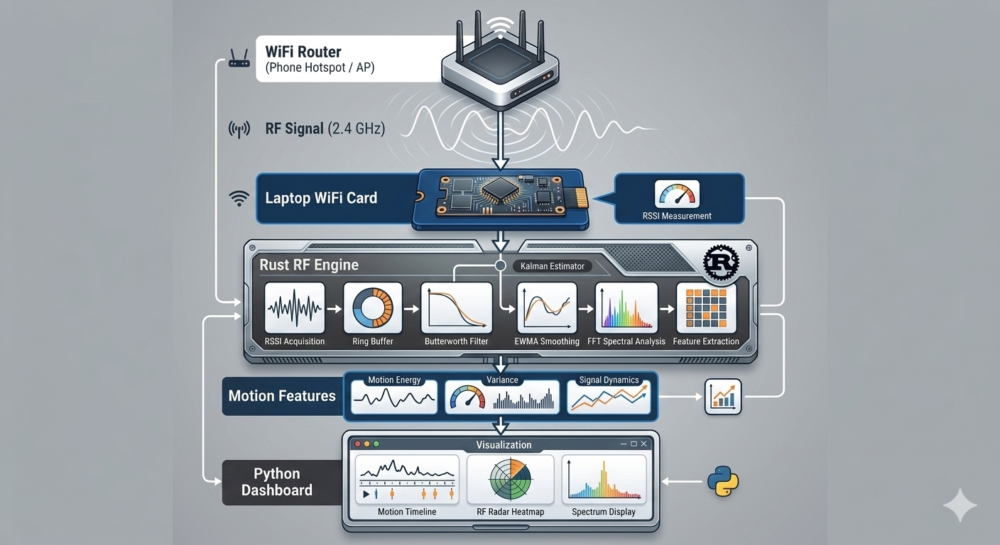
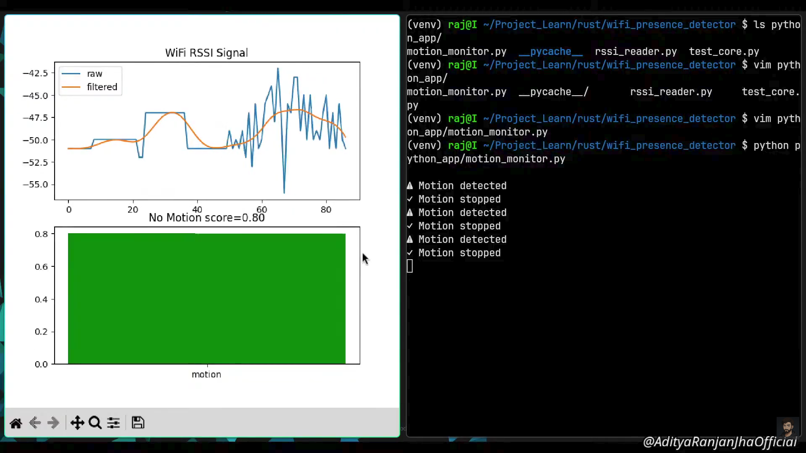
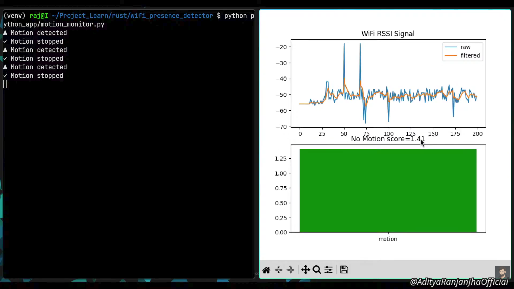
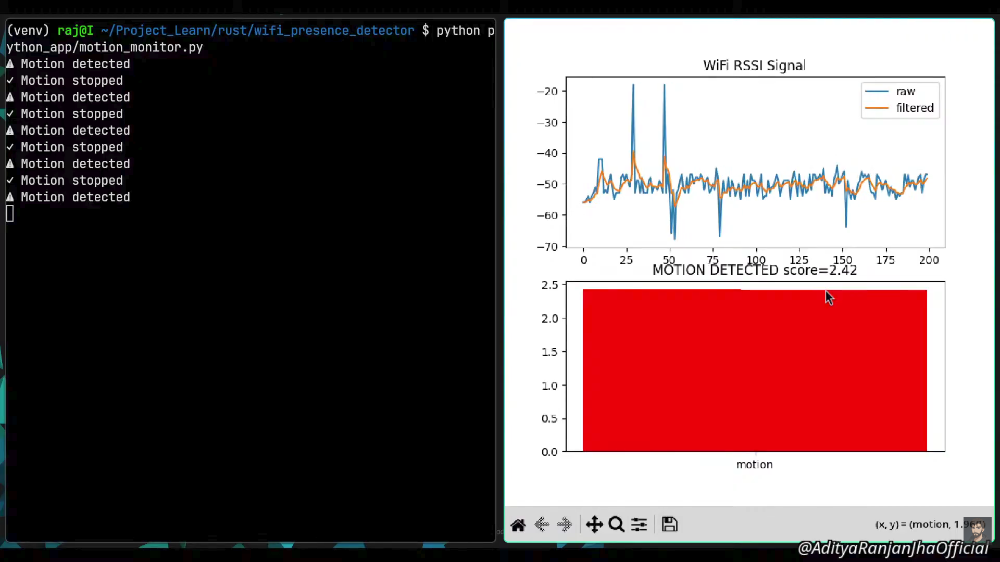
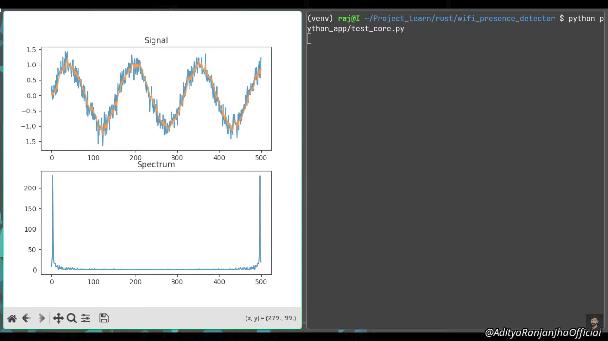

# WiFi RF Motion Sensing (Rust + Python)

> Detecting human movement using only WiFi signal fluctuations.

This project explores **RF sensing using commodity WiFi hardware**.  
Instead of cameras or external sensors, the system analyzes small fluctuations in **WiFi RSSI (Received Signal Strength Indicator)** caused by human movement.

When a person moves in a room, their body affects the **multipath propagation** of the WiFi signal.  
By applying signal processing techniques, these disturbances can be detected and analyzed.

The core signal processing engine is written in **Rust**, while **Python is used for visualization and experimentation**.

---
## Video Demonstration

▶️ [Watch the Demo Video](https://www.youtube.com/watch?v=QlMwy8KsRzQ&list=PLCUxG8soIk1b-DyhwEWvL3NwPvuNBiMCT&index=14)

## System Architecture
<p align="center">
  
</p>

## Screenshots

<p align="center">
  <b>Motion Monitor</b><br>
  
  
</p>

<p align="center">
  
  
</p>


---


## Project Status

Current capabilities:

- RSSI signal acquisition
- RF motion feature extraction
- Rust signal processing engine
- FFT-based analysis
- experimental visualization tools

Project is currently in **active research / development stage**.

## Example Output

Example terminal output from the RF sensing engine:

```text
motion 295.131 energy 89260.079 variance 87102.191
motion 303.738 energy 94028.485 variance 92256.992
motion 308.743 energy 97143.875 variance 95322.322
```

Higher motion values correspond to **larger disturbances in the WiFi signal**, typically caused by movement near the transmitter or receiver.

---

## Key Idea

WiFi signals interact with the environment through **multipath propagation**.

```
Router → Walls → Objects → Human Body → Laptop WiFi Card
```

Movement changes the RF path, which creates measurable fluctuations in RSSI.

This project builds a **signal processing pipeline** to analyze those changes.

---

## System Architecture

The RF sensing pipeline is built as a modular processing engine.

```
WiFi Router
     │
     ▼
Laptop WiFi Card (RSSI)
     │
     ▼
Rust RF Engine
 ├─ RSSI Acquisition
 ├─ Ring Buffer
 ├─ Butterworth Filter
 ├─ Kalman Filter
 ├─ EWMA Smoothing
 ├─ FFT Spectral Analysis
 └─ Feature Extraction
     │
     ▼
Python Interface
 ├─ Motion Monitor
 ├─ Radar Visualization
 └─ Experimental Scripts
```

Rust handles **performance-critical signal processing**, while Python provides the **interactive interface and visualization tools**.

---

## Repository Structure

```
.
├── poc1
│   ├── python_int
│   │   ├── breathing_monitor.py
│   │   ├── motion_monitor.py
│   │   ├── radar_monitor.py
│   │   ├── rssi_reader.py
│   │   └── test_core.py
│   └── rust_engine
│       ├── Cargo.toml
│       └── src
│           ├── butterworth.rs
│           ├── fft.rs
│           ├── filters.rs
│           ├── kalman.rs
│           └── lib.rs
│
├── poc2
│   ├── python_int
│   │   ├── run_engine.py
│   │   └── test_engine.py
│   └── rust_engine
│       ├── Cargo.toml
│       └── src
│           ├── acquisition.rs
│           ├── buffer.rs
│           ├── engine.rs
│           ├── features.rs
│           ├── fft.rs
│           ├── filters.rs
│           ├── kalman.rs
│           └── lib.rs
│
├── README.md
└── requirements.txt
```

---

## Proof of Concept (POC)

## POC1

Initial prototype exploring **RSSI signal processing**.

Features:

* RSSI acquisition from WiFi interface
* Butterworth filtering
* Kalman filtering
* EWMA smoothing
* FFT analysis
* motion detection experiments
* breathing detection experiments
* radar-style visualization

Python handles most of the experimentation in this stage.

---

## POC2

Second prototype focusing on **performance and architecture improvements**.

Major improvements:

* Rust-based **real-time RF engine**
* ring buffer for signal history
* structured feature extraction
* improved modular architecture
* Python used only for interface and visualization

Processing pipeline:

```
RSSI → Rust Engine → Filters → FFT → Feature Extraction → Python
```

---

## Installation

## 1. Clone Repository

```bash
git clone https://github.com/yourusername/wifi_rf.git
cd wifi_rf
```

---

## 2. Create Python Environment

```bash
python -m venv venv
source venv/bin/activate
```

---

## 3. Install Python Dependencies

```bash
pip install -r requirements.txt
```

---

## 4. Install Rust

Ensure Rust is installed:

```bash
rustc --version
cargo --version
```

If Rust is not installed:

```
https://rustup.rs
```

---

## Build Rust Engine

Inside the POC directory:

```bash
cd poc2/rust_engine
maturin develop --release
```

This compiles the Rust engine and exposes it as a Python module.

---

## Run Example

```bash
cd poc2/python_int
python run_engine.py
```

Example output:

```text
motion 297.711 energy 90831.760 variance 88631.632
motion 308.491 energy 96812.534 variance 95166.833
motion 332.601 energy 114080.124 variance 110623.390
```

Values change depending on movement near the WiFi source.

---

## Hardware Used

* Laptop WiFi adapter (Realtek RTL8723DE)
* Phone hotspot used as WiFi access point

No external sensors are required.

---

## Learning Process

This project was built as an exploration of **RF sensing and signal processing**.

During development, AI tools such as **ChatGPT** were used as a coding assistant to explore implementations and understand signal processing techniques.

The focus of the project was understanding:

* RF signal behavior
* signal processing pipelines
* Rust systems programming
* real-time feature extraction

---

## Future Work

Possible improvements include:

* real-time RF dashboard
* activity classification
* gesture detection
* WiFi radar heatmaps
* multi-person motion estimation
* netlink-based RSSI acquisition instead of spawning `iw` processes

---

## Why This Project Matters

WiFi signals already exist everywhere.
If we can analyze them properly, they can act as **passive sensors for the environment**.

This concept is used in research areas such as:

* RF sensing
* device-free localization
* indoor activity detection
* wireless radar systems

---

## Disclaimer

This project is an experimental exploration of **RF sensing using commodity WiFi hardware**.

RSSI-based sensing has limitations and may be noisy depending on hardware and environment.

---

## License

MIT License